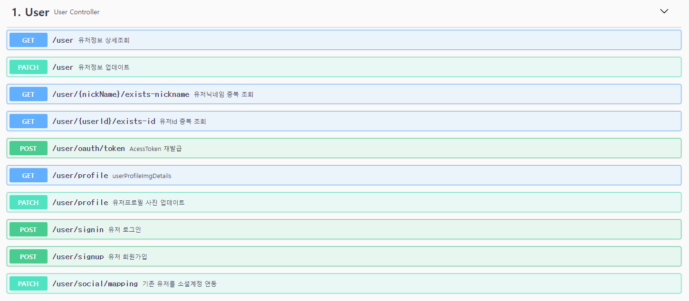
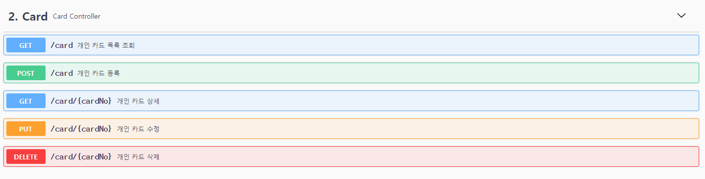
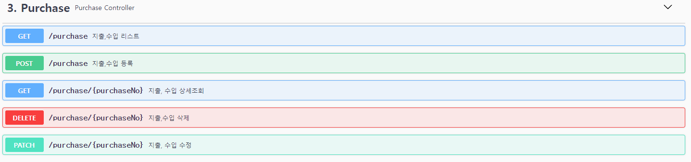
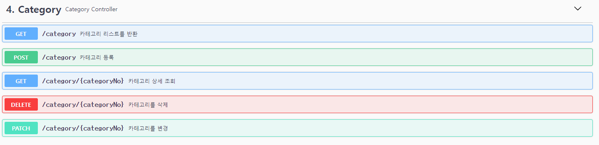
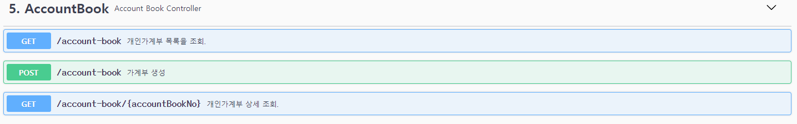
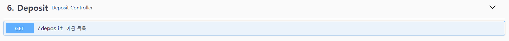
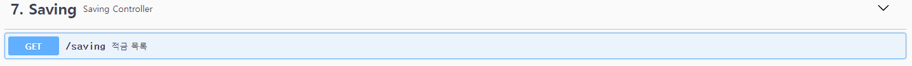
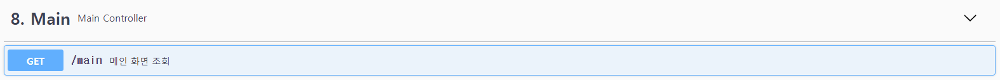

# Welcome  뜨끔한 가계부 🤑

> 뜨끔한 가계부 / 개인 토이프로젝트

🏠 [사이트 바로가기](https://cash.sundry.ninja)

## 🔨 Tech Stacks


<Br/>

## 📄Description
```sh
뜨끔한 가계부는 재테크가 중요한 시대의 다양한 금융정보를 사용자에게 제공 하며,
가계부 작성을 통한 소비습관 증진에 도움을 주기위한 사이트 제작을 목표로 하고 있으며 
끊임없이 업데이트 할 예정입니다.
```

## 🔍서비스 기능
### 1. User (사용자)


### 2. Card (카드)


### 3. Purchase (지출, 수입)


### 4. Category (카테고리)


### 5. AccountBook (가계부)


### 6. Depoist (예금)


### 7. Saving (적금)


### 8. Main (메인)


<br/>

> ### <span style="color:green">**TODO** 추가할 기능</span>

|날짜|기능|설명|
|----|---|---|
|미정|공유 가계부| 사용자간의 초대를 통한 가계부 공유작성
|미정|공유 가계부 권한 적용| 공유 가계부내의 권한을 추가하여 권한 별 기능 접근 추가
|미정|가계부 초대 및 알림 기능| 로그인 중인 사용자의 경우 Socket통신을 통하여 실시간으로 <br/>가계부 초대/수락/거절 상태를 사용자에게 알림을 주도록 구현

